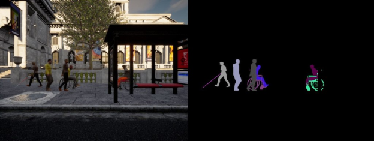
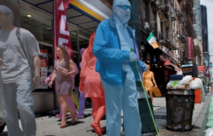

<u><g8>Challenge</g8></u>

## Important dates
- Challenge announcement: <strong>TBD</strong>
- Release of testing data: <strong>TBD</strong>
- Leaderboard open: <strong>TBD</strong>
- Challenge submission deadline [paper track]: <strong>TBD</strong>
- Challenge submission deadline: <strong>TBD</strong>
- Winner announcement: <strong>TBD</strong>

## Challenge overview

Towards building a community of accessibility research in computer vision conferences, we will introduce a relevant machine perception challenge with synthetic and real-world benchmarks. The challenge (based on our ICCV’21 paper, <a href="https://openaccess.thecvf.com/content/ICCV2021/papers/Zhang_X-World_Accessibility_Vision_and_Autonomy_Meet_ICCV_2021_paper.pdf">bit.ly/2X8sYoX</a>) will be used to benchmark various computer vision tasks when comparing new and established methods for fine-grained perception of tasks relevant to people with disabilities. The challenge is designed in the spirit of various other vision challenges that help advance the state-of-the-art of computer vision for autonomous systems, e.g., in robust vision (CVPR’21), human action recognition trajectory forecasting (CVPR’21), etc. Examples from the simulation environment and challenge can be seen below (as well as the final page of this proposal). We aim to use the challenge, together with a broad panel of speakers to uncover research opportunities and broadly spark the interest of computer vision and AI researchers working on more inclusive visual reasoning models in the future.
 

    
    
Fig. 1: An interactive simulation environment will be used as part of the workshop challenge for training machine perception and learning models in the context of accessibility (taken from <a href="https://openaccess.thecvf.com/content/ICCV2021/papers/Zhang_X-World_Accessibility_Vision_and_Autonomy_Meet_ICCV_2021_paper.pdf">bit.ly/2X8sYoX</a>).

 

    
    
Fig. 2: Various tasks and modalities incorporating use-cases of autonomous robots interacting with pedestrians with disabilities.

 

## Competition

We will use the recently introduced fine-grained instance segmentation benchmark from our ICCV 2021 paper (<a href="https://openaccess.thecvf.com/content/ICCV2021/papers/Zhang_X-World_Accessibility_Vision_and_Autonomy_Meet_ICCV_2021_paper.pdf">bit.ly/2X8sYoX</a>, Zhang et al., X-World:Accessibility, Vision, and Autonomy Meet)
The dataset involves a large synthetic and real-world set of images with pedestrians with mobility aids. Evaluation follows COCO evaluation, but with novel categories. Classes such as ‘cane’ currently have very low performance by Mask R-CNN (less than 1% accuracy). Moreover, people in wheelchairs tend to result in degraded performances as well (~50% reduction in relative performance). The benchmark is quite challenging, spanning weathers, towns, scenarios, camera perspectives, use-cases, and mobility aids. In terms of ethical considerations, we emphasize that this work does not imply prioritization of the decision-making (e.g., as a trolley problem). Our primary concern is with uncovering challenges which may impact perception of pedestrians with disabilities disproportionately. The videos used to construct the real-world dataset were voluntarily uploaded and shared in public domain sources, often for educational purposes. We also plan to expand upon the benchmark in the original ICCV paper in dataset size and tasks for the workshop. Submissions will be evaluated using a submission server (e.g., CodaLab/Kaggle). Assuming acceptance of the workshop proposal in December, we will release the benchmark in January, with a deadline in June to ensure ample time for the participants. Currently, the benchmark is mostly ready for release, however we would like to set up a suitable evaluation server and provide additional perception tasks to engage various computer vision researchers. Two example ground truth images are shown below:

Fig. 3: The workshop challenge will include an instance segmentation task in simulation and real-world data.

## Dataset download

## Evaluation

## Challenge paper submission guidelines

## Tentative schedule

### Join our **[mailing list](https://staging-temp-site.github.io/staging-temp-site.gitub.io/)** for updates.
For any questions, please contact **Eshed Ohn-Bar [eohnbar@gmail.com]**.

