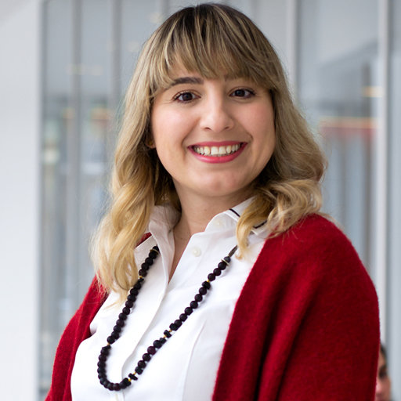
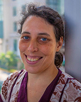

# Overview

The overarching goal of this workshop is to gather researchers, students, and advocates who work at the intersection of accessibility, computer vision, and autonomous systems. We plan to use the workshop to identify challenges and pursue solutions for the current lack of shared and principled development tools for data-driven vision-based accessibility systems. For instance, there is a general lack of vision-based benchmarks and methods relevant to accessibility (e.g., people with disabilities and mobility aids are currently mostly absent from large-scale datasets in pedestrian detection). Our workshop will provide a unique opportunity for fostering a mutual discussion between accessibility, computer vision, and robotics researchers and practitioners.

# Invited Speakers

    

     
    <a href="https://boleizhou.github.io/">Bolei Zhou</a> 
    University of California, Los Angeles
  

  

  

   
  

     
  <a href="https://www.cs.utexas.edu/~grauman/">Kristen Grauman</a> 
    University of Texas at Austin 
    Meta
  

  

  

   
  

     
  <a href="https://rpg.ifi.uzh.ch/people_scaramuzza.html">Davide Scaramuzza</a> 
    University of Zurich
  

## Organizers

  

     
    <a href="https://eshed1.github.io/">Eshed Ohn-Bar</a> 
    Boston University
  

  
  

  

   
  

     
  <a href="https://home.cs.colorado.edu/~DrG/AboutMe.html">Danna Gurari</a> 
    University of Colorado Boulder
  

  
    

  

       
  

     
  <a href="https://researcher.watson.ibm.com/researcher/view.php?person=us-chiekoa">Chieko Asakawa</a> 
    Carnegie Mellon University and IBM
  

  
    

  

  

     
  <a href="https://ischool.umd.edu/directory/hernisa-kacorri/">Hernisa Kacorri</a> 
    University of Maryland
  

  
    

  

  
    

     
  <a href="http://www.cs.cmu.edu/~kkitani/">Kris Kitani</a> 
    Carnegie Mellon University
  

  

  

  
    

     
  <a href="https://make4all.org/">Jennifer Mankoff</a> 
    University of Washington
  

  

<!-- ## Advising committee -->

<!-- 

 

     
  <a href="https://staging-temp-site.github.io/staging-temp-site.gitub.io/">[Name]</a> 
    [Institution]
  

  
  

  

   
  

     
  <a href="https://staging-temp-site.github.io/staging-temp-site.gitub.io/">[Name]</a> 
    [Institution]
  

 -->

<!-- ## Program Committee -->
<!-- 
| --- | --- |
|  |  | -->

<!-- ## Student Organizers -->
<!-- 
| --- | --- |
|  |  |
 -->

<!-- ## Call for papers -->
<!-- Please refer to the **[call for papers](./call-for-papers.html)** page for more details. -->

<!-- 

<u><g8>Challenge</g8></u>

 -->

<!-- ## Challenge overview -->
<!-- 

Toward building a community of accessibility research in computer vision conferences, we introduce a computer vision challenge with synthetic and real-world benchmarks. The challenge (based on our ICCV’21 paper, <a href="https://openaccess.thecvf.com/content/ICCV2021/papers/Zhang_X-World_Accessibility_Vision_and_Autonomy_Meet_ICCV_2021_paper.pdf">bit.ly/2X8sYoX</a>) will be used to benchmark various computer vision tasks when comparing new and established methods for fine-grained perception of tasks relevant to people with disabilities. The challenge is designed in the spirit of various other vision challenges that help advance the state-of-the-art of computer vision for autonomous systems, e.g., in robust vision (CVPR’21), human action recognition trajectory forecasting (CVPR’21), etc. E
 

    
    
Fig. 1: An interactive simulation environment will be used as part of the workshop challenge for training machine perception and learning models in the context of accessibility (taken from <a href="https://openaccess.thecvf.com/content/ICCV2021/papers/Zhang_X-World_Accessibility_Vision_and_Autonomy_Meet_ICCV_2021_paper.pdf">bit.ly/2X8sYoX</a>).

  

    
    
An example from the instance segmentation challenge for perceiving people with mobility aids.

  

 -->

## Challenge Organization

  

     
  <a href="mailto:sgzk@bu.edu">Zhongkai Shangguan</a> 
    Boston University
  

  
    

  

  

  
  
  

     
    <a href="mailto:hjkim37@bu.edu">Hee-Jae Kim</a> 
    Boston University
  

  
 

  
## Challenge

We are excited to announce the following challenges for 2025:  

<ul>
  <li><a href="https://eval.ai/web/challenges/challenge-page/2493/overview">3D Human Motion Generation Track.</a></li>
  <li><a href="https://eval.ai/web/challenges/challenge-page/2491/overview">Navigation Instruction Generation Track.</a></li>
</ul>
  

Please refer to each challenge website for more details.

 
  
  
  
## Call for Papers

We encourage submission of relevant research (including work in progress, novel perspectives, formative studies, benchmarks, methods) as extended abstracts for the poster session and workshop discussion (up to 4 pages in CVPR format, not including references). CVPR Overleaf template can be <a href="https://www.overleaf.com/latex/templates/cvpr-2022-author-kit/qbmjsdxryffn">found here</a>. Latex/Word templates can be <a href="https://cvpr2022.thecvf.com/sites/default/files/2021-10/cvpr2022-author_kit-v1_1-1.zip">found here</a>. Please send your extended abstracts to <a href="mailto:mobility@bu.edu">mobility@bu.edu</a>. Note that submissions do not need to be anonymized. Extended abstracts of already published works can also be submitted. Accepted abstracts will be presented at the poster session, and will not be included in the printed proceedings of the workshop.
Topics of interests by this workshop include, but are not limited to:
   
  <ol>
  <li>AI for Accessibility</li>
  <li>Accessibility-Centered Computer Vision Tasks and Datasets</li>
  <li>Data-Driven Accessibility Tools, Metrics and Evaluation Frameworks</li>
  <li>Practical Challenges in Ability-Based Assistive Technologies</li>  
  <li>Accessibility in Robotics and Autonomous Vehicles</li>  
  <li>Long-Tail and Low-Shot Recognition of Accessibility-Based Tasks</li>  
  <li>Accessible Homes, Hospitals, Cities, Infrastructure, Transportation</li>   
  <li>Crowdsourcing and Annotation Tools for Vision and Accessibility</li>  
  <li>Empirical Real-World Studies in Inclusive System Design</li>  
  <li>Assistive Human-Robot Interaction</li>  
  <li>Remote Accessibility Systems</li>   
  <li>Multi-Modal (Audio, Visual, Inertial, Haptic) Learning and Interaction</li>  
  <li>Accessible Mobile and Information Technologies</li>  
  <li>Virtual, Augmented, and Mixed Reality for Accessibility</li>  
  <li>Novel Designs for Robotic, Wearable and Smartphone-Based Assistance</li>  
  <li>Intelligent Assistive Embodied and Navigational Agents</li>   
  <li>Socially Assistive Mobile Applications</li>  
  <li>Human-in-the-Loop Machine Learning Techniques</li>  
  <li>Accessible Tutoring and Education</li>  
  <li>Personalization for Diverse Physical, Motor, and Cognitive Abilities</li>  
  <li>Embedded Hardware-Optimized Assistive Systems</li>  
  <li>Intelligent Robotic Wheelchairs</li>  
  <li>Medical and Social and Cultural Models of Disability</li>  
  <li>New Frameworks for Taxonomies and Terminology</li>  
    </ol>

## Important workshop dates 
- Updated challenge release: <strong>3/31/2025</strong>
- Challenge submission deadline: <strong>6/8/2025</strong> 
- Workshop abstract submission deadline: <strong>6/9/2025</strong> (11:59PM PST, please submit extended abstracts via email to mobility@bu.edu) 
- Abstract notification: <strong>6/10/2025</strong>
- Challenge winner announcement: <strong>6/11/2025</strong>

## Previous workshops
<a href="./index_2023">2nd AVA: Accessibility, Vision, and Autonomy Meet, CVPR 2023</a> 
<a href="./index_2024">3rd AVA: Accessibility, Vision, and Autonomy Meet, CVPR 2024</a> 

<!-- ### Join our **[mailing list](https://staging-temp-site.github.io/staging-temp-site.gitub.io/)** for updates. -->

<!-- ## Videos -->

<!-- 

    

      <h4><u>OpenGuide</u> </h4>
        <iframe src="https://www.youtube.com/embed/mGq9sL1spzc" frameborder="0"
          allow="accelerometer; autoplay; encrypted-media; gyroscope; picture-in-picture"
          style="width:100%; clip-path:inset(1px 1px);height: 30vh" allowfullscreen></iframe>
    

    

        

    

    
    <!--div align="center"  style="width:45%; float: left;">
      <h4 ><u>X-World</u> </h4>
      
        <iframe src="https://www.youtube.com/embed/z_YwWIZWg58" frameborder="0"
          allow="accelerometer; autoplay; encrypted-media; gyroscope; picture-in-picture"
          style="width:100%; clip-path:inset(1px 1px); height: 30vh" allowfullscreen></iframe>
      
    

  </div--> 
  
## Acknowledgements 
 Supported by <a href="https://www.sigaccess.org/">Special Interest Group on Accessible Computing</a>.
