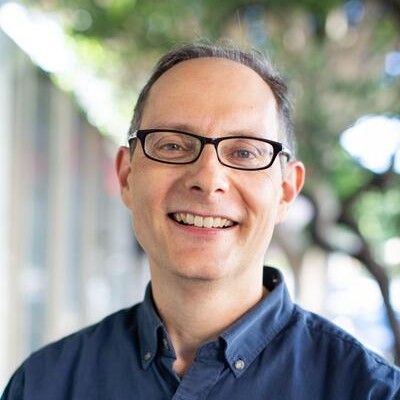
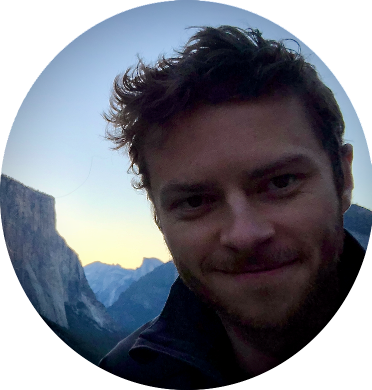
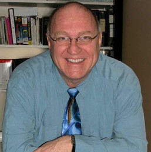
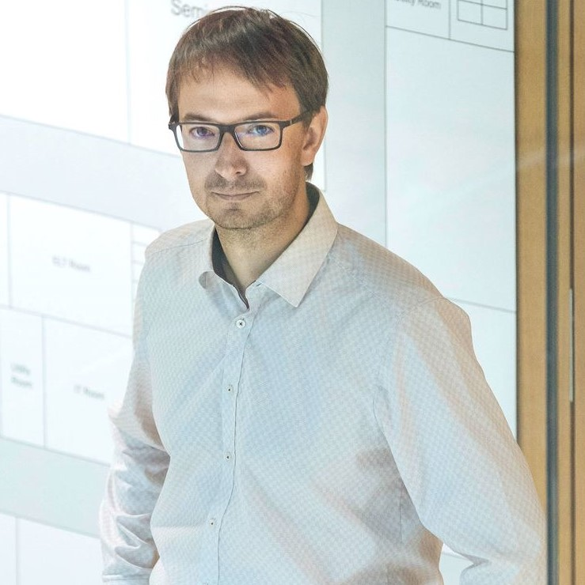
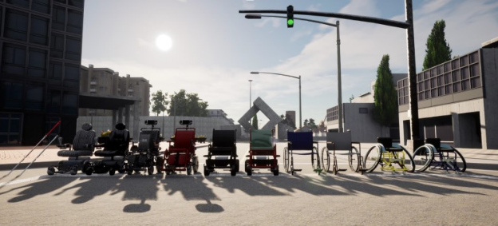
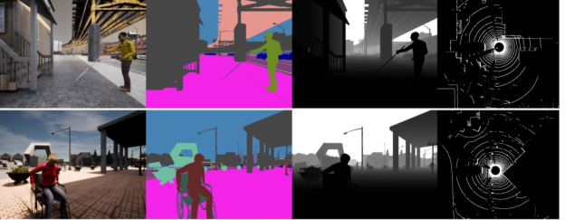
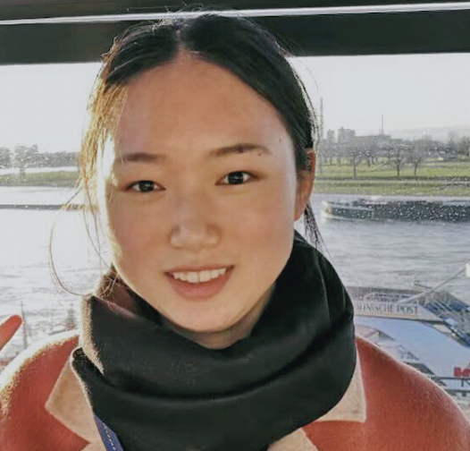
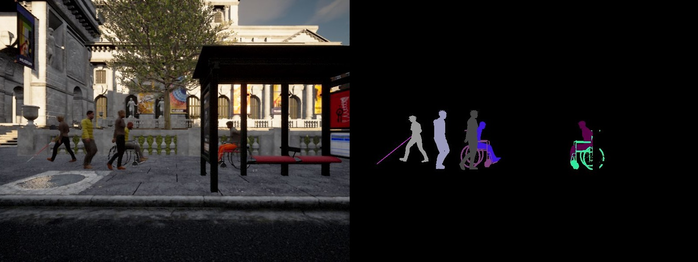

# Overview

The overarching goal of this workshop is to gather researchers, students, and advocates who work at the intersection of accessibility, computer vision, and autonomous systems. We plan to use the workshop to identify challenges and pursue solutions for the current lack of shared and principled development tools for data-driven vision-based accessibility systems. For instance, there is a general lack of vision-based benchmarks and methods relevant to accessibility (e.g., people with disabilities and mobility aids are currently mostly absent from large-scale datasets in pedestrian detection). Our workshop will provide a unique opportunity for fostering a mutual discussion between accessibility, computer vision, and robotics researchers and practitioners.

# Invited Speakers

  
  

     
  <a href="https://www.inclusivemobility.com/">Chandrika Jayant</a> 
    Volkswagen Group of America, Principal Designer and Manager, Inclusive Mobility Team
  

  
  

  

  

     
    <a href="https://www.linkedin.com/in/clemdwright">Clem Wright</a> 
    Waymo, Product Manager for Accessibility
  

  
  

  

  

     
  <a href="https://jonfroehlich.github.io/">Jon E. Froehlich</a> 
    University of Washington, Researcher in Human-Computer Interaction and Accessibility
  

  
  

  

  

     
    <a href="https://www.ski.org/users/james-coughlan">James Coughlan </a> 
    Smith-Kettlewell Eye Research Institute, Researcher in Computer Vision Technologies for Blind and Visually Impaired
  

  

  

  

    

     
    <a href="https://adriengaidon.com/">Adrien Gaidon </a> 
    Toyota Research Institute, Head of Machine Learning Research
  

  
  

  

  

     
    <a href="https://pelilab.partners.org/"> Eli Peli </a> 
    Harvard, Professor of Ophthalmology Harvard Medical School, Researcher in Disability, Rehabilitation, and Assistive Technologies for Low Vision
  

  
  

  

  

     
    <a href="https://giarre.wordpress.com/"> Laura Giarré </a> 
    University of Modena and Reggio Emilia, NTNU 
  

## Schedule
<!-- 
| Time | Event | Duration |
| ----- | ----- | ----- |
| 08:30-08:35 | introduction/opening remarks | (5 min)
| 08:35-09:00 | invited talk 1 | (25 min)
| 09:00-09:30 | invited talk 2 | (30 min)
| 09:30-10:00 | invited talk 3 | (30 min)
| 10:00-10:15 | coffee break | (15 min)
| 10:15-10:45 | invited talk 4 | (30 min)
| 10:45-11:15 | invited talk 5 | (30 min)
| 11:15-11:45 | invited talk 6 | (30 min)
| 11:45-12:15 | Challenge results/ oral presentation of the best papers | (30 min)
| 12:15-12:45 | Panel discussion | (30 min)
| 12:45-13:30 | posters/demo spotlights | (45 min)
 -->
Full program will be coming soon with 30-min keynotes, panel discussion, challenge results and winners, and poster session.

## Organizers

  

     
    <a href="https://eshed1.github.io/">Eshed Ohn-Bar</a> 
    Boston University
  

  
  

  

   
  

     
  <a href="https://home.cs.colorado.edu/~DrG/AboutMe.html">Danna Gurari</a> 
    University of Colorado Boulder
  

  
  

  

   
  

     
  <a href="http://www.cs.cmu.edu/~kkitani/">Kris Kitani</a> 
    Carnegie Mellon University
  

  
  

  

   
  

     
  <a href="http://ai.bu.edu/ksaenko.html#">Kate Saenko</a> 
   Boston University
  

  

     
    <a href="http://www.cvlibs.net/">Andreas Geiger</a> 
    University of Tübingen and the MPI for Intelligent Systems
  

  
  

  

  
  

     
  <a href="https://researcher.watson.ibm.com/researcher/view.php?person=us-chiekoa">Chieko Asakawa</a> 
    Carnegie Mellon University and IBM
  

  

  

  
  

     
  <a href="https://jonfroehlich.github.io/">Jon E. Froehlich</a> 
    University of Washington
  

  
  

  

  
  

     
  <a href="https://www.inclusivemobility.com/">Chandrika Jayant</a> 
    Volkswagen Group of America
  

<!-- ## Advising committee -->

<!-- 

 

     
  <a href="https://staging-temp-site.github.io/staging-temp-site.gitub.io/">[Name]</a> 
    [Institution]
  

  
  

  

   
  

     
  <a href="https://staging-temp-site.github.io/staging-temp-site.gitub.io/">[Name]</a> 
    [Institution]
  

 -->

<!-- ## Program Committee -->
<!-- 
| --- | --- |
|  |  | -->

<!-- ## Student Organizers -->
<!-- 
| --- | --- |
|  |  |
 -->

<!-- ## Call for papers -->
<!-- Please refer to the **[call for papers](./call-for-papers.html)** page for more details. -->

<!-- 

<u><g8>Challenge</g8></u>

 -->

<!-- ## Challenge overview -->
<!-- 

Towards building a community of accessibility research in computer vision conferences, we introduce a computer vision challenge with synthetic and real-world benchmarks. The challenge (based on our ICCV’21 paper, <a href="https://openaccess.thecvf.com/content/ICCV2021/papers/Zhang_X-World_Accessibility_Vision_and_Autonomy_Meet_ICCV_2021_paper.pdf">bit.ly/2X8sYoX</a>) will be used to benchmark various computer vision tasks when comparing new and established methods for fine-grained perception of tasks relevant to people with disabilities. The challenge is designed in the spirit of various other vision challenges that help advance the state-of-the-art of computer vision for autonomous systems, e.g., in robust vision (CVPR’21), human action recognition trajectory forecasting (CVPR’21), etc. E
 

    
    
Fig. 1: An interactive simulation environment will be used as part of the workshop challenge for training machine perception and learning models in the context of accessibility (taken from <a href="https://openaccess.thecvf.com/content/ICCV2021/papers/Zhang_X-World_Accessibility_Vision_and_Autonomy_Meet_ICCV_2021_paper.pdf">bit.ly/2X8sYoX</a>).

  

    
    
An example from the instance segmentation challenge for perceiving people with mobility aids.

  

 -->

## Challenge Organization

  

     
    <a href="mailto:zhangjim@bu.edu">Jimuyang Zhang</a> 
    Boston University
  

  
  

  

   
  

     
  <a href="mailto:sgzk@bu.edu">Zhongkai Shangguan</a> 
    Boston University
  

  
  

  

   
  

     
  <a href="mailto:mzheng27@bu.edu">Minglan Zheng</a> 
    Boston University
  

  
  

  

<!--    
  

     
  <a href="http://ai.bu.edu/ksaenko.html#">Kate Saenko</a> 
   Boston University
  
 -->

## Challenge

The challenge involves a synthetic instance segmentation benchmark incorporating use-cases of autonomous systems interacting with pedestrians with disabilities (see Zhang et al., X-World: Accessibility, Vision, and Autonomy Meet, ICCV 2021 <a href="https://openaccess.thecvf.com/content/ICCV2021/papers/Zhang_X-World_Accessibility_Vision_and_Autonomy_Meet_ICCV_2021_paper.pdf">bit.ly/2X8sYoX</a>). The benchmark contains challenging accessibility-related person and object categories, such as `cane' and `wheelchair.' We aim to use the challenge to uncover research opportunities and spark the interest of computer vision and AI researchers working on more robust visual reasoning models for accessibility. 
  

    
    
An example from the instance segmentation challenge for perceiving people with mobility aids.

   
  The team with the top performing submission will be invited to give short talks during the workshop and will receive a financial award of <b>$500</b> and an <a href="https://store.opencv.ai/products/oak-d">OAK—D camera</a>. 
    
  
  To participate in the challenge and download the data please go to the <a href="https://eval.ai/web/challenges/challenge-page/1690/overview">challenge website.</a>
  
  

## Call for Papers

We encourage submission of relevant research (including work in progress, novel perspectives, formative studies, benchmarks, methods) as extended abstracts for the poster session and workshop discussion (up to 4 pages in CVPR format). 
Topics of interests by this workshop include, but are not limited to:

  <ol>
  <li>AI for Accessibility</li>
  <li>Accessibility-Centered Computer Vision Tasks and Datasets</li>
  <li>Data-Driven Accessibility Tools, Metrics and Evaluation Frameworks</li>
  <li>Practical Challenges in Ability-Based Assistive Technologies</li>  
  <li>Accessibility in Robotics and Autonomous Vehicles</li>  
  <li>Long-Tail and Low-Shot Recognition of Accessibility-Based Tasks</li>  
  <li>Accessible Homes, Hospitals, Cities, Infrastructure, Transportation</li>   
  <li>Crowdsourcing and Annotation Tools for Vision and Accessibility</li>  
  <li>Empirical Real-World Studies in Inclusive System Design</li>  
  <li>Assistive Human-Robot Interaction</li>  
  <li>Remote Accessibility Systems</li>   
  <li>Multi-Modal (Audio, Visual, Inertial, Haptic) Learning and Interaction</li>  
  <li>Accessible Mobile and Information Technologies</li>  
  <li>Virtual, Augmented, and Mixed Reality for Accessibility</li>  
  <li>Novel Designs for Robotic, Wearable and Smartphone-Based Assistance</li>  
  <li>Intelligent Assistive Embodied and Navigational Agents</li>   
  <li>Socially Assistive Mobile Applications</li>  
  <li>Human-in-the-Loop Machine Learning Techniques</li>  
  <li>Accessible Tutoring and Education</li>  
  <li>Personalization for Diverse Physical, Motor, and Cognitive Abilities</li>  
  <li>Embedded Hardware-Optimized Assistive Systems</li>  
  <li>Intelligent Robotic Wheelchairs</li>  
  <li>Medical and Social and Cultural Models of Disability</li>  
  <li>New Frameworks for Taxonomies and Terminology</li>  
    </ol>

## Important workshop dates
- Challenge release: <strong>February 27, 2022.</strong>
- Workshop abstract submission deadline: <strong>June 10, 2022.</strong> 
- Challenge submission deadline: <strong>June 10, 2022.</strong>
- Abstract notification: <strong>June 13, 2022.</strong>
- Challenge winner announcement: <strong>June 20, 2022.</strong>

<!-- ### Join our **[mailing list](https://staging-temp-site.github.io/staging-temp-site.gitub.io/)** for updates. -->

<!-- ## Videos -->

<!-- 

    

      <h4><u>OpenGuide</u> </h4>
        <iframe src="https://www.youtube.com/embed/mGq9sL1spzc" frameborder="0"
          allow="accelerometer; autoplay; encrypted-media; gyroscope; picture-in-picture"
          style="width:100%; clip-path:inset(1px 1px);height: 30vh" allowfullscreen></iframe>
    

    

        

    

    
    <!--div align="center"  style="width:45%; float: left;">
      <h4 ><u>X-World</u> </h4>
      
        <iframe src="https://www.youtube.com/embed/z_YwWIZWg58" frameborder="0"
          allow="accelerometer; autoplay; encrypted-media; gyroscope; picture-in-picture"
          style="width:100%; clip-path:inset(1px 1px); height: 30vh" allowfullscreen></iframe>
      
    

  </div--> 

